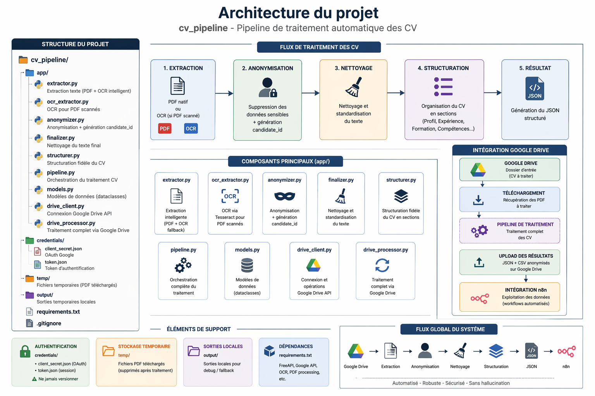

# CV Processing Pipeline (AI + Google Drive)

Ce projet est un **moteur intelligent de traitement de CV** conçu pour :

> Transformer des CV bruts (PDF, scan) en **données structurées exploitables par l’IA et les outils RH**

---

# Objectifs

- Récupérer automatiquement des CV depuis Google Drive  
- Extraire le contenu (PDF natif + OCR pour scans)  
- Anonymiser les données sensibles (RGPD compliant)  
- Structurer les informations sans altérer le contenu  
- Générer des JSON exploitables (pour n8n ou autres systèmes)  
- Maintenir un registre unique sans doublons  

---

# Architecture du projet 



---

# Fonctionnement global

## Pipeline 

Google Drive (CV_Entrants)  
        ↓  
drive_processor.py  
        ↓  
pipeline.py  
        ↓  
extractor.py → OCR si nécessaire  
        ↓  
anonymizer.py  
        ↓  
finalizer.py  
        ↓  
structurer.py  
        ↓  
JSON technique + JSON structuré  
        ↓  
Upload vers Google Drive  
        ↓  
Mise à jour du registre CSV  

---

# Organisation sur Google Drive

| Dossier | Description |
|--------|------------|
| CV_Entrants | CV à traiter |
| CV_JSON_Techniques | JSON techniques |
| CV_JSON_Structures | JSON structurés |
| candidate_registry.csv | registre des CV traités |

---

# Fonctionnalités principales

## 1. Extraction intelligente

- PDF texte → extraction directe  
- PDF scanné/images → OCR automatique  

---

## 2. Anonymisation RGPD

Suppression de :
- nom  
- email  
- téléphone  
- adresse  
- LinkedIn  

Remplacement du nom par :
Identifiant candidat : CAND-XXXXXX 


---

## 3. Structuration fidèle

- Aucun résumé  
- Aucun ajout  
- Aucun contenu inventé  
- Respect exact du CV  

---

# Installation 

```bash
pip install -r requirements.txt 

```

# Exécution 

```bash

python -m app.drive_processor 

```